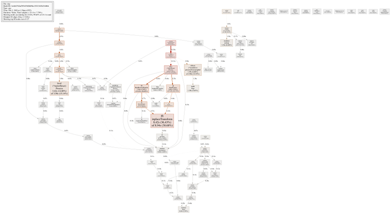
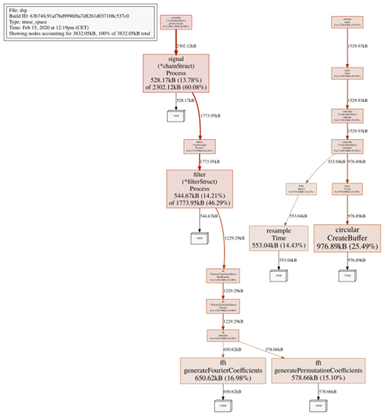
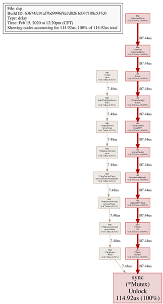

# Analysis of go-dsp-guitar real-time performance

There has recently been some scepticism about the real-time performance of *go-dsp-guitar* and criticism about some design choices that we made, particularly about the use of a high-level programming language with automatic memory management / garbage collection and the use of so-called mutex (mutual exclusion) locks used to coordinate multiple parallel threads of execution accessing shared resources, like shared memory regions. Some people therefore concluded that *go-dsp-guitar* was "unsuitable for professional use". Since we are audio enthusiasts ourselves and, obviously, make heavy use of the application, we had to disagree. However, so far, we didn't have sufficient evidence to support our impressions / claims. Therefore, we chose to take an in-depth look at certain aspects of the architecture of *go-dsp-guitar* and their implications on performance. In particular, we chose to actually measure an instance of *go-dsp-guitar* running in "real-time mode" (i. e. as a JACK client) with a profiler attached, take a look at some of the performance metrics, such as CPU usage, dynamic memory (heap) allocations, garbage collection pauses and finally discuss what these metrics mean regarding the real-timeliness of *go-dsp-guitar*. As an additional result, this strategy would also let us identify shortcomings and potential spots for further optimizations.

For our tests, we let *go-dsp-guitar* (either `v1.5.0` or what will become `v1.5.1`) run in real-time mode (as a JACK 2 client) at a sample rate of 96 kHz. All of our measurements were performed with *go-dsp-guitar* (v1.5.0) simulating a pre-amp / overdrive unit, and a power amplifier based on a FIR-filter with an order of 2048.

## What does go-dsp-guitar use CPU time for?

At first, we will take a look at what *go-dsp-guitar* actually spends CPU-time for.

[View full resolution image](img/performance/pprof-cpu.png)

At the very top left of this image, you see the `crosscall2` callback originating from *JACKd*. This enters our application code as a call to the `hwio.process` function.

`hwio.process` then does several things. First, it invokes `go-jack.(*Port).GetBuffer`, which is a thin wrapper around `jack_get_buffer`. This leads to a cross-language call from Go code into C code (`runtime.cgocall`), which in turn performs a system call (`runtime.exitsyscall`) to communicate with *JACKd* in order to obtain a pointer to the hardware buffers.

This already looks a bit suspicious, especially since the *JACK* documentation says the following about the `process` callback in the documentation of the `jack_set_process_callback` function.

> The code in the supplied function must be suitable for real-time execution. That means that it cannot call functions that might block for a long time. This includes all I/O functions (disk, TTY, network), malloc, free, printf, pthread\_mutex\_lock, sleep, wait, poll, select, pthread\_join, pthread\_cond\_wait, etc, etc.

While the documentation does not explicitely mention system calls, these are normally also excluded for use in the real-time thread. However, since this system call appears to originate from within `jack_port_get_buffer` itself, and we're expected to call `jack_port_get_buffer` on each invocation of our `process` callback, there's really nothing we can do about this.

> Do not cache the returned address across process() callbacks. Port buffers have to be retrieved in each callback for proper functionning.

After the hardware buffers have been obtained from *JACKd*, we go on to convert input samples from `jack_default_audio_sample_t` (which is a `typedef` for `float` / `float32`) to `float64` (`double`) in `hwio.samplesToFloats`, then invoke `controller.(*controllerStruct).process`, which performs the actual processing, and finally convert our generated output samples from `float64` (`double`) back to `jack_default_audio_sample_t` in `hwio.floatsToSamples`.

Obtaining the buffers from *JACKd* takes 0.39 % of our total runtime, the conversion from JACK samples to floats takes 0.69 % of our total runtime and the conversion from floats back to JACK samples takes 1.38 % of our total runtime. Most of the time is, of course, spent in `controller.(*controllerStruct).process`, which does perform actual processing. So let's continue taking a closer look what this actually does.

`controller.(*controllerStruct).process` first dispatches each input buffer to one of the "asynchronous worker threads" by calling `runtime.chansend1`, which then process the actual signal chains for each input channel concurrently. It then blocks on `runtime.chanrecv`, which will return after all concurrent signal chains have been processed. Then, it will invoke the metronome (`metronome.(*metronomeStruct).Process`), which accounts for 0.78 % of the total runtime, the room simulation / spatializer (`spatializer.(*spatializerStruct).Process`), which accounts for 2.16 % of the total runtime, and, finally, the level meters (`level.(*meterStruct).Process`), which account for 15.14 % of the total runtime.

We were surprised to see that the level meters are responsible for such a significant fraction of the total CPU time spent, since they basically perform one multiply-accumulate (FMA) operation (and a pointer increment and a conditional branch to check, whether they reached the end of the current buffer, and, of course, some `LOAD` / `STORE` operations to move data from RAM into CPU registers and back) per sample processed. The reason for the significant amount of runtime is, that the level meters are not only invoked **per signal chain**, but actually **per input / output port** and that for *N* channels, there will actually be *2 \* N + 3* ports, one input and one output per channel, as well as a pair of master outputs, which carries the stereo mixdown from the spatializer, and finally a dedicated output for the metronome. As a result, we actually spent some time optimizing the level meters by turning away from the "one level-meter per channel" approach towards a "multi-channel level meter" approach, where a single data structure is allocated, which processes all input and output channels at once. We also thought about parallelizing the level meters, since the work done for each port will be totally independant from all the others. However, this actually resulted in a performance **degradation**, probably since the individual threads were doing too little work compared to the overhead incurred by making use of threading. (Remember that it is basically just one multiply-accumulate operation per sample. This also serves to demonstrate about which amounts of time we are talking here, if "one multiply-accumulate operation per sample" already amounts to 15.14 % of total runtime.) Therefore, we kept the single-threaded approach. However, processing all channels in one pass and storing the analysis in a contiguous data structure helped us improve cache locality.

Next, let's take a look at the actual time spent processing the actual channels and signal chains. Since this happens in concurrent threads, it has its own root in the call graph, originating from `controller.(*controllerStruct).processAsync`. This will invoke `signal.(*chainStruct).Process` in order to process the actual signal chains, which will first pass the signal through the pre-amplifier / overdrive simulation (`effects.(*overdrive).processOversampled`), which amounts to 12.55 % of the actual runtime, almost half of which (5.63 %) it spends in the standard library evaluating an exponential function (`math.Exp`).

After the signal went through the overdrive effects unit, it is passed onto the power amplifier simulation, which will make use of a FIR filter (in this case of order 2048) to process it (`filter.(*filterStruct).Process`). With 52.83 % of total runtime, this is by far the most expensive operation. The FIR filter takes one forward FFT of a real-valued vector (`fft.RealFourier`), one complex-valued vector multiplication (`filter.hadamardComplex`), and an inverse FFT of a Hermetian vector (`fft.RealInverseFourier`) to complete for all samples. Most of this time is spent on the actual FFTs, with a total of 22.72 % of runtime spent on the forward FFT, 26.09 % of runtime spent on the inverse FFT (which is slightly more computationally expensive than the forward FFT), and just 1.90 % spent on the vector product. The runtime actually spent in the `fft.RealFourier` (2.94 %) and `fft.RealInverseFourier` (4.90 %) functions (opposed to functions transitively invoked from them) is time spent for the "outermost" butterfly pass, while both `fft.RealFourier` and `fft.RealInverseFourier` delegate to the complex-valued `fft.inplaceTransform`, which calculates the remaining "inner" butterfly passes using an iterative (as opposed to recursive) algorithm. The FFTs spend a tiny fraction of time shuffling data around in memory (`fft.permute`, `fft.swapComplexInPlace`, `cmplx.Conj`, `runtime.memmove`). However, most of the time is actually spent performing arithmetics.

The small boxes at the very bottom-right of the CPU-time diagram are time spent in the system's scheduler, and we can also see `runtime.sysmon` running in its own thread, concurrent to our actual application, which is the memory management / garbage collector. We can see that the runtime spends 0.26 % scanning the heap, trying to determine whether to trigger a collection cycle (`runtime.gcTrigger.test`). However, it never actually starts a collection cycle, since, unless you change buffer size or sample rate, *go-dsp-guitar* does not dynamically allocate memory during processing. Even **if** a GC cycle is triggered, from version 1.5 onwards, Go features a fully concurrent, low-latency (usually sub-millisecond collections) garbage collector based on the tricolor algorithm. It is **not** a simple mark-and-sweep collector with stop-the-world semantics. In versions 1.6, 1.7 and 1.8, the garbage collector got further optimizations for low latency.

## Won't go-dsp-guitar have bad performance since it is written in a "garbage-collected" language?

We chose to implement *go-dsp-guitar* in Go, a modern, high-level programming language with automatic memory management ("garbage collection"). Choosing a high-level language helped us produce code that is portable across operating systems and hardware platforms, remains maintainable and gets our concepts across.

Most data structures are allocated on program startup or during the first invocations of the `process` callback. The latter is sometimes required since some allocations might depend on the actual sample rate or buffer size used, which is not known to a client until the audio block has actually arrived for processing. Let's take a look at the heap profile of a running instance of *go-dsp-guitar*. The configuration is the same as for the CPU profile above.

[View full resolution image](img/performance/pprof-heap.png)

On the right "root", you can see that our main function was invoked (`runtime.main`, `main.main`), which then initializes the controller (`controller.(*controllerStruct).Operate`, `controller.(*controllerStruct).initialize`). The controller then imports FIR filter coefficients from disk (`filter.Import`), which leads to a heap allocation of 553.04 kB to hold the filter coefficients. It also creates a tuner (`tuner.Create`), which leads to a heap allocation of 976.89 kB which holds a circular buffer to asynchronously calculate the autocorrelation function on a section of the input signal for the instrument tuner (`circular.CreateBuffer`).

Then, from within the actual processing threads (`controller.(*controllerStruct).processAsync`), the signal chain itself allocates buffers to serve as front and back buffers for the actual signal processing units to operate on (`signal.(*chainStruct).Process`), which leads to a heap allocation of 528.17 kB. Then, the power amp effects unit (`effects.(*poweramp).Process`) applies a FIR filter to a signal (`fft.(*filterStruct).Process`), which by itself leads to an allocation of 544.67 kB from the heap for buffers, as well as a further heap allocation of 1229.29 kB used by the FFT (`fft.(*fourierTransformStruct).RealFourier`, `fft.(*fourierTransformStruct).Fourier`, `fft.initialize`), of which 650.62 kB are used to store the roots of unity for the FFT (`fft.generateFourierCoefficients`) and 578.66 kB are used to store indices for the input / output permutations required for the iterative in-place FFT algorithm (`fft.generatePermutationCoefficients`).

All of these data structures are used throughout the lifetime of the entire application, with exception to the 544.67 kB allocated directly by `filter.(*filterStruct).Process`, which will be reclaimed when the power amplifier unit is discarded. No further heap allocations are performed when the actual signal processing is carried out. This will prevent the garbage collector from running, unless there are configuration changes triggered by the user from the UI, which may cause memory to get allocated from the heap. Even in these cases, garbage collection cycles will be rare, since the garbage collector by default only runs when the heap size reaches double the size that was reached at the end of the last collection cycle. Finally, note that even when a garbage collection cycle is started, the collection will run concurrently to our application and usually finish in less than a millisecond of runtime.

## Won't go-dsp-guitar have bad performance since it makes use of mutex locks?

In fact, *go-dsp-guitar* makes use of mutex (mutual exclusion) locks in order to protect data structures during concurrent access by multiple threads. This protection serves to ensure that data races do not introduce inconsistencies into these data structures, which could lead to unexpected results or program instability / crashes. While there are other synchronization primitives available, mutexes are based on a special *atomic test-and-set* machine instruction and are therefore very efficient.

The *atomic test-and-set* instruction is a machine instruction which reads a bit from memory into a register and at the same time sets it to "one". This means that, when multiple processors perform an *atomic test-and-set* on the same bit, only for one of them will the instruction return "zero". For each other processor, the instruction will return "one". This behaviour can be used to arbitrate access to a shared resource by ensuring that only the processor, which read a "zero" can access the shared memory location. All other processors will have to try again at a later time, until they finally read "zero" at some point in time. After a processor that acquired the shared resource (got a "zero" from the *atomic test-and-set*) is done performing its work, it can release that resource again by setting the mutex bit back to zero. (This operation does not have to be atomic.)

A thread that did not manage to acquire a mutex may get put into a waiting state by the operating system scheduler and woken up when that mutex is reset / released, in order for the operating system to make use of the time that thread is "blocked" by the mutex by executing other threads / processes. Therefore, failure of a real-time thread to acquire a mutex may be detrimental to real-time performance, since it might result in that real-time thread getting preempted by the scheduler in the operating system. Due to this, there is a certain consensus that one shall not try to acquire mutexes from within a real-time thread. While, in principle, this approach is correct, this does not mean that use of mutexes will destroy / degenerate real-time behaviour **in every case**. In *go-dsp-guitar*, we make use of mutexes at certain points within the application in order to **guarantee correctness**, but these locks will not be contended under normal circumstances. In addition, we make use of special `RWLock`s, which allow concurrent access by an unlimited amount of readers, but only a single mutator. This will normally lead to the non-realtime (control) thread getting blocked by the real-time (processing) threads, but not the other way round. The following is a mutex contention profile of *go-dsp-guitar* running in real-time mode (as a JACK client).

[View full resolution image](img/performance/pprof-mutex.png)

Note that the only thing that waits on a mutex here is network communication, so your audio signal will be processed without delay.

